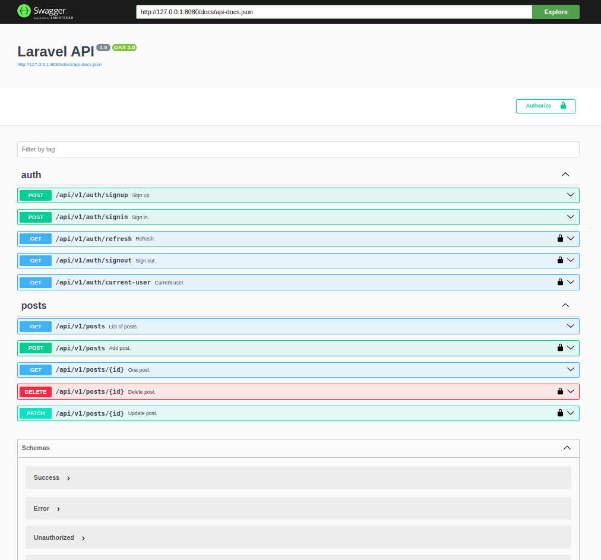
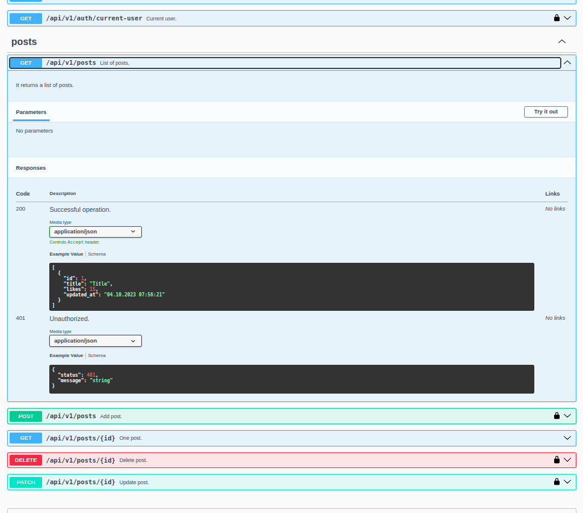

# Laravel 10 API with JWT auth and Swagger Doc

## API Documentation

```
  https://domain.name/api/v1/doc
```

#### Screenshot 1


#### Screenshot 2


#### Screenshot 3



## DEV mod

To generate swagger documentation run this command

```
php artisan l5-swagger:generate
```
